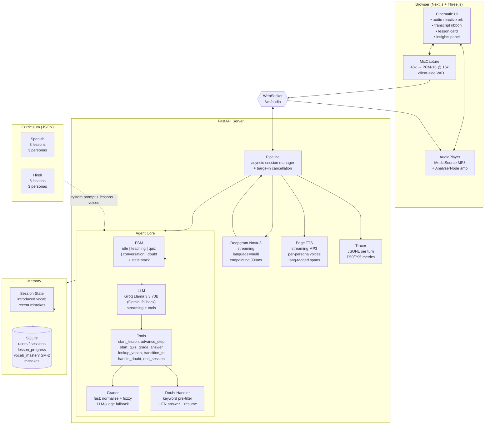

# Architecture

## Module map

| Path | Role |
|------|------|
| `server/main.py` | FastAPI app, WebSocket endpoint, health and progress REST routes. |
| `server/pipeline.py` | Per-session orchestration: audio in → STT → agent → TTS, with barge-in cancellation. |
| `server/agent/core.py` | Agent loop: prompt assembly, LLM streaming, tool dispatch, doubt fast-path. |
| `server/agent/fsm.py` | Session state machine + doubt-resume stack + difficulty adaptation. |
| `server/agent/grader.py` | Two-tier semantic grading. |
| `server/agent/doubt.py` | Multilingual doubt-trigger detection. |
| `server/agent/quiz.py` | Mixed-type quiz generator. |
| `server/agent/personas.py` | Persona resolution for TTS voice selection. |
| `server/services/llm.py` | Groq / Gemini adapter (OpenAI-compatible). |
| `server/services/stt.py` | Deepgram WebSocket client. |
| `server/services/tts.py` | Edge TTS streamer with lang-tagged span routing. |
| `server/services/vad.py` | Silero VAD wrapper. |
| `server/tools/definitions.py` | OpenAI-format tool schemas. |
| `server/curriculum/{spanish,hindi}/*` | Lesson JSON, voice config, system prompt. |
| `server/db/repo.py` | SQLite repo: progress, mistakes, SM-2 vocab. |
| `server/observability/tracer.py` | Per-turn JSONL traces. |
| `client/app/page.tsx` | Cinematic stage. |
| `client/components/Orb.tsx` | WebGL shader orb. |
| `client/lib/session.ts` | WebSocket session manager. |
| `client/lib/audio.ts` | Mic capture + MP3 playback. |
| `evals/*` | pytest harness. |

## Data flow per turn

1. **Mic → WebSocket**: `MicCapture` resamples 48 kHz → 16 kHz PCM-16, sends raw bytes over WS.
2. **STT**: `DeepgramStream` emits interim + final transcripts with language tag.
3. **Endpointing**: server collects final transcript, fires `pending_event`.
4. **Barge-in check**: any in-flight TTS task is cancelled.
5. **Doubt fast-path**: regex over user text. If doubt detected → push FSM state, answer in English, pop state.
6. **Else → LLM stream**: with full conversation history + tool schemas. Tool calls accumulate during stream.
7. **Tool dispatch**: each tool runs locally. Results fed back as `role:tool` messages for the next turn's context.
8. **TTS**: assistant text is split on `<es>` / `<hi>` / `<en>` tags. Each span synthesized with the persona's matching voice. Audio bytes stream to client.
9. **Trace flush**: JSONL written with per-stage durations.

## Why this shape

- **Single-process pipeline**: keeps barge-in latency observable. Cancelling the TTS task is a function call, not an inter-service message.
- **Tool calling for state changes**: every meaningful state transition (start lesson, grade, transition persona) is a typed tool call, so the agent's intent is auditable in the trace.
- **Curriculum as data, not code**: adding French is `mkdir server/curriculum/french && touch lessons.json voice_config.json system_prompt.md`. No code edits.
- **FSM state stack** lets nested doubts work: ask a doubt while answering a doubt — the stack handles it.
